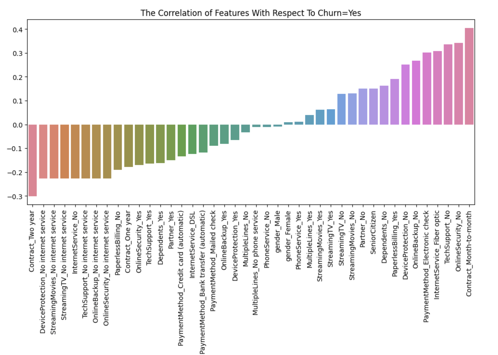
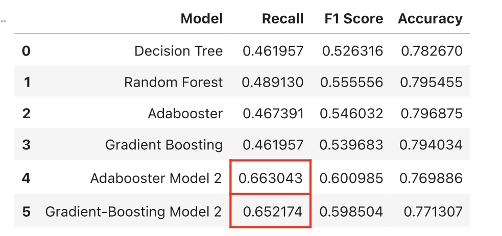

# Telephone-Internet Customer Churn Prediction Using Tree-Based and Boosting Models

 
## Project Overview
This project aims to predict customer churn for a telecommunications company using tree-based and boosting machine learning models. The project includes comprehensive exploratory data analysis, cohort analysis, and the development of predictive models.

## Table of Contents
- [Project Overview](#project-overview)
- [Project Structure](#project-structure)
- [Dataset](#dataset)
- [Exploratory Data Analysis](#exploratory-data-analysis)
- [Predictive Modeling](#predictive-modeling)
- [Results](#results)
- [Conclusion](#conclusion)
 

## Project Structure
The main parts of this project include:
- Part 1: Comprehensive Exploratory Data Analysis
- Part 2: Churn Cohort Analysis
- Part 3: Tree-based and Boosting Machine Learning Predictive Models
- Part 4: Improve Models Performance by Oversampling Minority Class

## Dataset
The dataset used for this project is sourced from the IBM sample data set collection. It includes information about:
- Customers who left within the last month (Churn)
- Services that each customer has signed up for (phone, multiple lines, internet, online security, online backup, device protection, tech support, streaming TV and movies)
- Customer account information (tenure, contract, payment method, paperless billing, monthly charges, total charges)
- Demographic info (gender, age range, partners, dependents)

## Exploratory Data Analysis
A detailed exploratory data analysis was conducted to understand the dataset, identify patterns, and gain insights. This involved checking for missing values, analyzing the distribution of features, and visualizing relationships between features and the target variable (Churn).

 

## Predictive Modeling
Tree-based and boosting models were implemented to predict customer churn. These models included:
- Decision Trees
- Random Forests
- Gradient Boosting Machines (GBM)
- Adabooster

 

## Results
The performance of the models was evaluated using metrics such as accuracy, recall, and F1-score. The results showed that the boosting methods predicted customer churn better when I performed oversampling of the minority class.

 

## Conclusion
This project demonstrates the effectiveness of tree-based models combined with boosting methods in classification tasks such as the prediction of customer churn. Telecommunications companies can implement strategies to retain customers and reduce churn rates by identifying key factors contributing to churn.
 
 

## Installation
To run this project, we need to have Python installed along with the following libraries:
- Numpy
- Pandas
- Matplotlib
- Seaborn
- Scikit-learn
